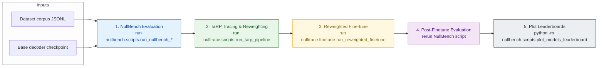

# TaRP End-to-End Workflow

Use this diagram for any supported dataset (AG News, HateXplain, SST-2). Substitute dataset-specific corpus paths, NullBench scripts, and display names as needed.

**Step details**
- **1. NullBench Evaluation:** Generate collapse diagnostics (`experiments/<dataset>/*_results.json`) for the base model.
- **2. TaRP Tracing & Reweighting:** Feed those results plus the dataset corpus into the TaRP pipeline to write `document_traces.jsonl`, `bias_scores.jsonl`, and `reweighted_manifest.jsonl` under `experiments/tarp_<dataset>`.
- **3. Reweighted Fine-tune:** Continue pre-training the base checkpoint using the corpus + `reweighted_manifest.jsonl` to create `<model>-<dataset>-tarp` checkpoints.
- **4. Post-Finetune Evaluation:** Rerun the matching NullBench script to log the improved metrics for the TaRP checkpoint.
- **5. Plot Leaderboards:** Aggregate and visualize the latest runs with `python -m nullbench.scripts.plot_models_leaderboard` (per-dataset PNGs refresh automatically when evaluations finish).
